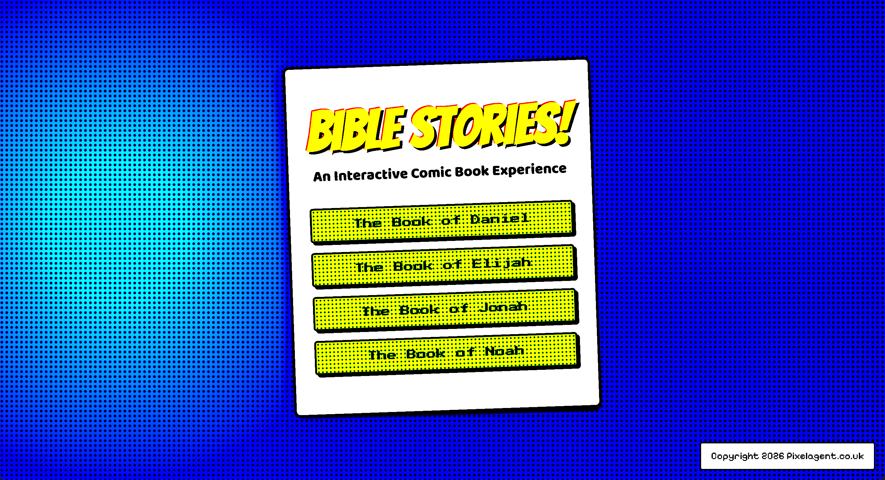

# Bible Stories: Interactive Comics

Welcome to the Bible Stories Interactive Comics project! This repository contains a collection of web-based, interactive comics that bring classic stories from the Bible to life.

You can view the main index of all comics [here](https://purna.github.io/bible-stories/).

## Available Comics

This repository contains the source code and assets for the following comic series.

---

---

### [The Book of Daniel](./Daniel/)

This series covers the major events from the life of Daniel and his friends during their time in Babylon.

*   **Daniel and Friends in Babylon (Chapter 1)**: Taken to Babylon, Daniel and his friends refuse the king's rich food to honor God. They eat only vegetables and drink water, yet they grow healthier and wiser than all the other young men.
*   **Nebuchadnezzar's Dream (Chapter 2)**: King Nebuchadnezzar has a troubling dream of a great statue. God reveals the dream and its meaning to Daniel, foretelling a succession of earthly kingdoms to be replaced by God's everlasting kingdom.
*   **The Fiery Furnace (Chapter 3)**: Shadrach, Meshach, and Abednego refuse to bow to a golden idol and are thrown into a blazing furnace. They are miraculously saved by an angel.
*   **Nebuchadnezzar's Humiliation (Chapter 4)**: The king has another dream, interpreted by Daniel as a warning against pride. The king is driven from his palace to live like a wild animal until he acknowledges God's sovereignty.
*   **The Writing on the Wall (Chapter 5)**: A mysterious hand writes a message on the wall during King Belshazzar's feast, which Daniel interprets as a prophecy of the kingdom's downfall.
*   **Daniel in the Lions' Den (Chapter 6)**: Daniel is thrown into a den of lions for praying to God, but an angel saves him by shutting the lions' mouths.
*   **Daniel's Vision of Four Beasts (Chapter 7)**: Daniel has a vision of four great beasts, representing four kingdoms, culminating in the establishment of an everlasting kingdom by the "Son of Man".

---

### [The Book of Elijah](./Elijah/)

This series follows the dramatic life of the prophet Elijah in the northern kingdom of Israel.
*   **Elijah and the Ravens (1 Kings 17)**: During a great famine, God commands ravens to bring food to Elijah by the Brook Cherith.
*   **The Contest on Mount Carmel (1 Kings 18)**: Elijah challenges 450 prophets of Baal to a dramatic showdown to prove that the Lord is the one true God.
*   **A Still, Small Voice (1 Kings 19)**: Fleeing for his life, a discouraged Elijah encounters God not in the wind, earthquake, or fire, but in a gentle whisper.
*   **Elijah in the Whirlwind (2 Kings 2)**: At the end of his life, Elijah is taken up to heaven in a whirlwind, with a chariot and horses of fire appearing.

---

### [The Book of Jonah](./Jonah/)

This series tells the story of the reluctant prophet Jonah and his mission to the great city of Nineveh.
*   **The Great Storm (Chapter 1)**: Jonah attempts to flee from God's command, but a mighty tempest threatens the ship he is on.
*   **The Deep (Chapter 2)**: Thrown overboard, Jonah is swallowed by a great fish and spends three days and nights in its belly before praying for deliverance.
*   **The City of Nineveh (Chapter 3)**: After being released, Jonah goes to Nineveh and preaches its impending doom, leading the entire city to repent.
*   **The Tree and the Heat (Chapter 4)**: Jonah becomes angry at God's mercy. God teaches him a lesson about compassion through a gourd plant that provides, and then loses, its shade.

---

### [The Book of Moses](./Moses/)

This series follows the rescue of Israel out of Egypt, the journey through the wilderness, and Moses' view of the promised land from Mount Nebo.
*   **The Child in the River (Chapter 1)**: Hebrew slaves fill Egypt. A mother hides her son in a basket among the Nile reeds. Pharaoh's daughter finds him and adopts him into the palace that ordered his death.
*   **Exile and the Burning Bush (Chapter 2)**: Moses flees to Midian. After forty years of shepherding, a bush blazes with fire but does not burn — and the God of Abraham calls him by name.
*   **Let My People Go (Chapter 3)**: Moses and Aaron confront Pharaoh with three signs: a serpent-staff, leprous-and-healed hand, and water turned to blood. Pharaoh's heart hardens; each refusal adds another plague.
*   **Passover Night (Chapter 4)**: Marked doors, a hurried meal, and the death of every Egyptian firstborn. Pharaoh finally drives the people out — the night becomes the LORD's Passover.
*   **A Path Through the Water (Chapter 5)**: Trapped between Pharaoh's army and the Red Sea, Moses stretches out his staff. The waters stand as walls. Israel walks through on dry ground.
*   **Enough for Today (Chapter 6)**: Bitter water at Marah, quail in the evening, manna every morning. Some gathered much. Some gathered little. None had any shortage.
*   **Thunder on Sinai (Chapter 7)**: At Mount Sinai, the LORD descends in fire, smoke, and the sound of a trumpet. He gives the Ten Commandments.
*   **The Broken Tablets (Chapter 8)**: While Moses is on the mountain, the people make a golden calf. He throws the tablets down. He pleads with God. He returns to receive them again.
*   **The Long Wilderness (Chapter 9)**: Spies, fear at the border, and forty years of wandering. At Meribah, Moses strikes the rock and is told he will not enter the land.
*   **The Land from Afar (Chapter 10)**: On Mount Nebo, the LORD shows Moses the whole promised land. He appoints Joshua, blesses the people, and dies — a hundred and twenty years old, his eyes not weak, his legs not feeble.

---

### [The Book of Noah](./Noah/)

This series covers the epic story of Noah, the ark, and the great flood that covered the Earth.
*   **Building the Ark (Genesis 6)**: God sees the wickedness of the world and instructs Noah, a righteous man, to build a massive ark to save his family and pairs of every kind of animal.
*   **The Great Flood (Genesis 7)**: Rain falls for forty days and forty nights, covering the entire Earth with water, while Noah and his family remain safe inside the ark.
*   **The Dove and the Olive Branch (Genesis 8)**: After the waters recede, Noah sends out a dove, which returns with an olive leaf, signaling that the land is beginning to reappear.
*   **The Rainbow Covenant (Genesis 9)**: After they leave the ark, God sets a rainbow in the sky as a sign of His covenant to never again destroy the Earth with a flood.
